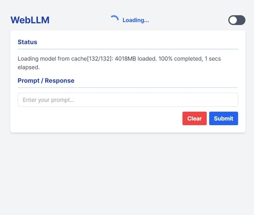
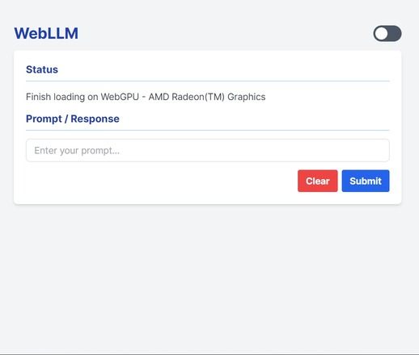

# Wellm

Wellm is a web application built using WebLLM, an open-source project that allows running large language models (LLMs) directly in the browser, leveraging WebGPU for hardware acceleration.

- [WebLLM](https://github.com/mlc-ai/web-llm) allows LLMs to run in-browser.
- This provides user with data privacy.
- To accelerate the performance of the Local LLM, WebGPU is used.
- on The first Load the app will download the model, which will take considerable time.
- Later reloads will not require any downloading and will work using the in-browser LLM.
- Quantisized models can offer quicker download times.

---
**NOTE** 

*Wellm is a research and testing project aimed at pushing the boundaries of WebLLM technology and exploring its capabilities. It is not intended for production use.*

---

## Features

- **Offline Support**: After the first model download finishes the application can function without an internet connection. (if UI is run locally)
- **Interactive Chat Interface**: Users can enter prompts and receive responses from the loaded LLM in real-time.
- **Loading Progress**: A loading spinner and progress bar indicate when the model is being downloaded and initialized.
- **Markdown Rendering**: Responses from the LLM are rendered as Markdown, allowing for formatted text, code blocks, and other formatting options.
- **Syntax Highlighting**: Code blocks in the LLM's responses are syntax-highlighted for better readability.
- **Clear Conversation**: Users can clear the conversation history with a single click.
- **Keyboard Support**: Prompts can be submitted by pressing the "Enter" key, in addition to clicking the "Submit" button.
- **Dark mode**: Dark Mode is available.

## Technologies Used

- **WebLLM**: The core library that enables running LLMs in the browser using WebGPU.
- **Tailwind CSS**: A utility-first CSS framework for styling the user interface.
- **Marked.js**: A library used for rendering Markdown content.
- **Prism.js**: A syntax highlighting library for code blocks.

## Images

<div style="display: flex; justify-content: space-around; max-width: 50%;">
  
  
</div>

## Installation

1. Clone the repository:

```
git clone [https://github.com/Mesfrum/Wellm.git](https://github.com/Mesfrum/Wellm.git)
```

2. Navigate to the project directory:

```
cd Wellm
```

3. Install the required dependencies:

```
npm install
```

## Usage

1. Open the `index.html` file in a compatible web browser - Chrome, Chrome Canary. (WebGPU support required).

2. Wellm will automatically load the specified LLM model(s) and display the chat interface.

3. Enter your prompts in the input field and click the "Submit" button or press "Enter" to receive responses from the LLM.

4. Use the "Clear" button to reset the conversation history.

5. You can switch between different LLM models by modifying the `myAppConfig` object in the `main.js` file.

## Configuration

Wellm can be configured for different models by modifying the `myAppConfig` object in the `main.js` file. 

Each object in the `model_list` array represents an LLM model that can be loaded by the application. The properties are:

- `model_url`: The URL of the Hugging Face repository containing the model weights.
- `local_id`: A unique identifier for the model.
- `model_lib_url`: The URL of the WebLLM model library (.wasm file) required for running the model.
- `required_features` (optional): An array of WebGPU features required by the model.

You can add or remove models from the `model_list` array as needed.

## Future Improvements and Features

- **User Authentication**: Implement user authentication to enable personalized experiences and save conversation history.
- **Performance Optimization**: Further optimize performance by fine-tuning WebLLM and leveraging browser capabilities.
- **Integration with External Services**: Preferably over a LAN.
- **Model Selection**: Support for loading multiple LLM models, and users can switch between them with ease.

## Contributing

Contributions are welcome! If you find any issues or have suggestions for improvements, please open an issue or submit a pull request on the project's GitHub repository.

## License

This project is licensed under the [MIT License](LICENSE).

## Acknowledgments

- [WebLLM](https://github.com/mlc-ai/web-llm) for providing the core functionality of running LLMs in the browser.
- [Tailwind CSS](https://tailwindcss.com/) for the utility-first CSS framework.
- [Marked.js](https://marked.js.org/) for Markdown rendering.
- [Prism.js](https://prismjs.com/) for syntax highlighting.
